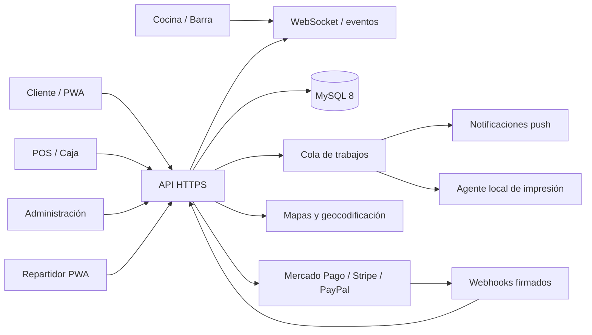

# Arquitectura objetivo: de demostración a plataforma operativa

La interfaz actual funciona como demostración en el navegador y persiste información localmente. El esquema MySQL agregado define el destino de datos, pero no modifica todavía el comportamiento existente.

## Componentes propuestos

## Decisiones principales

1. La API es la única capa autorizada para escribir en MySQL.
2. La PWA conserva caché para catálogo y experiencia sin conexión, pero los pedidos reales se confirman en el servidor.
3. Los cambios de pedidos se publican por WebSocket; los clientes se suscriben solo a canales que les pertenecen.
4. La ubicación del repartidor se comparte únicamente durante una entrega activa y con consentimiento registrado.
5. Las comandas se crean por área mediante `product_preparation_areas` y `production_tickets`.
6. Los trabajos de impresión fallidos permanecen en `print_jobs` para reintento o reimpresión.
7. Las pasarelas se confirman mediante webhooks firmados e idempotentes; elegir un método no marca automáticamente un pago como pagado.
8. Para Stripe, una futura integración web debería usar Checkout Sessions y métodos de pago dinámicos. Las llaves privadas pertenecen al backend o a una bóveda, nunca a la PWA.

## Contratos mínimos de API

| Dominio | Endpoints iniciales |
|---|---|
| Autenticación | `POST /auth/login`, `POST /auth/refresh`, `POST /auth/logout`, `GET /me` |
| Catálogo | `GET /menu`, CRUD `/admin/products`, CRUD `/admin/categories` |
| Pedidos | `POST /orders`, `GET /orders/:id`, `POST /orders/:id/status` |
| Producción | `GET /production/tickets`, `POST /production/tickets/:id/accept`, `POST /production/tickets/:id/ready` |
| Pagos | `POST /orders/:id/payments`, `POST /payments/:id/validate`, `POST /webhooks/:provider` |
| Reparto | `POST /orders/:id/assign`, `GET /driver/assignments`, `POST /driver/location`, `POST /assignments/:id/status` |
| Caja | `POST /cash/shifts`, `POST /cash/movements`, `POST /cash/shifts/:id/close` |
| Tiempo real | Canal de pedido, canal por sucursal, canal privado del repartidor |

## Orden recomendado de implementación

1. Backend, migraciones, autenticación y permisos.
2. Catálogo y sincronización de productos.
3. Creación de pedidos e historial de estados.
4. Cocina/barra en tiempo real y agente de impresión.
5. Caja, conciliación y pasarela en ambiente de pruebas.
6. Reparto, mapas, consentimiento y ubicación.
7. Push, reportes, respaldos, monitoreo y endurecimiento de seguridad.

## Operación productiva mínima

- HTTPS obligatorio.
- Respaldos automáticos cifrados y prueba periódica de restauración.
- Monitoreo de API, base de datos, colas y webhooks.
- Registro estructurado con `request_id`, sin secretos ni datos de tarjeta.
- Límites de peticiones, bloqueo por intentos y autenticación multifactor para administradores.
- Ambientes separados para desarrollo, pruebas y producción.

